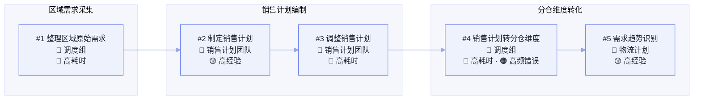
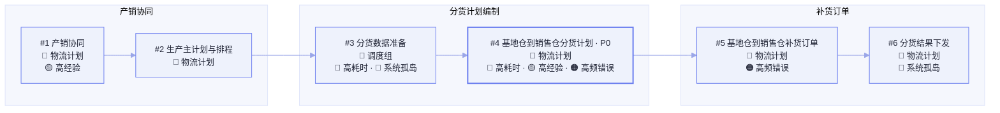
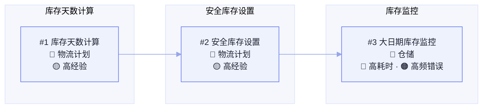
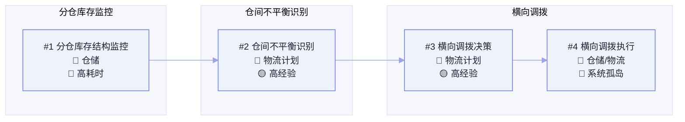
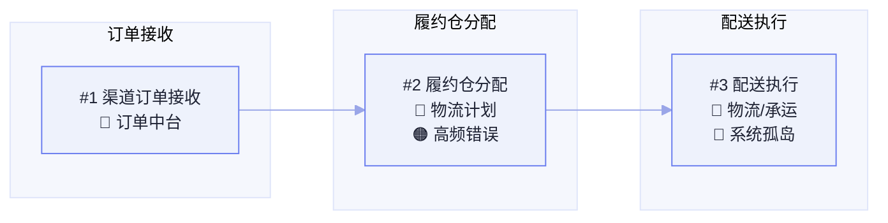

# 伊利奶粉事业部 · 业务现状全景图

> **版本：** v1.3 | **更新日期：** 2026-06-28
>
> **对应业务阶段：** 理需求（SLP）· 阶段2 业务全景与瓶颈识别 · 步骤2.2 业务现状全景图汇总
>
> **方法论依据：** SLP 阶段1方法（高阶价值框架）+ 阶段2方法（聚焦价值段拆解 → 全景汇总）
>
> **输入依据：** FDE 商机描述与分仓补货业务全貌口述、FDE 调研信息「分仓补货计划业务解读」（客户内部信息）；FDE 提供的伊利奶粉事业部深度研究报告（2025-2026 公开信息）；伊利股份 2024 年年度报告；伊利官网及公开报道

## 1 总览

**这份全景图做了什么：** 把伊利奶粉事业部的端到端经营拆成 5 条价值流、每条价值流内拆出价值段，圈定聚焦范围后，再把聚焦价值段逐层下钻到"业务流程 → 任务"，形成一张可看、可对话、可指着说话的现状全景。

**重点看什么：** 聚焦范围落在两个连续段——**价值流②「需求与供应计划」的「销售计划与需求预测 → 分货与补货计划 → 库存计划」**，以及**价值流④「仓储物流与履约」的「销售分仓管理与横向调拨 → 订单履约与配送」**。这两段合起来，正是商机要打造的"推拉结合智能分仓补货计划体系"的完整落点。

**为什么这样圈：** 分货补货计划是整条供应链的枢纽——它向上承接销售计划、向下驱动生产与仓储、向外决定渠道履约。五大经营指标（分货效率、有货率、周转、新鲜度、跨仓履约）几乎全部由这个枢纽决定，是典型的"牵一发动全身"的杠杆点。

**当前洞察：** 调研确认了一条清晰的因果链——**"需求输入不够精细 → 分货模式偏推式 → 计划形成依赖人工和 Excel → 库存监控与调拨响应不及时 → 分货效率/有货率/周转/新鲜度/跨仓履约均受影响"**。这印证了商机的"体系级"定位：不是单个环节的问题，而是从"经验驱动"到"系统化、规则化、智能化"的整条机制重构。

**需要 FDE 做什么：** ① 核准本章各价值段的流程主干、执行角色、业务规则是否真实在跑；② 补齐任务级量化数据和客户原话，把 P0 从"推断"升级为"实证"；③ 建议安排客户验证 Workshop，共创确认。

## 2 高阶价值框架

### 2.1 价值流与价值段总览

伊利奶粉事业部可沿端到端经营主线拆为 5 条价值流，价值流之间以业务衔接串联成链。价值流相对稳定、与具体业务板块（婴幼儿营养品 / 成人营养品等）正交——同一套价值流在不同板块复用，仅细节有差异；本阶段先讲清框架逻辑，不按板块拆解。

<b style="color:#6b7eef;">核心洞察：</b>奶粉事业部的经营命门不在单一环节，而在「需求与供应计划」这条枢纽——它向上承接销售计划、向下驱动生产与仓储、向外决定渠道履约。五大经营指标几乎全部由它决定，故聚焦范围圈定在「销售计划→分货补货→库存计划」与「分仓调拨→订单履约」两段连续整体。

价值流 5 条
价值段 16 个
★ 聚焦范围 2 段
P0 痛点 1 个（推断）
客户 Workshop 一手原话 + 深度研究推断

① 产品与品牌经营

洞察需求 → 研发创新 → 品牌上市

消费者洞察与趋势研究

▸ 定义 / 目标 / 不聚焦理由

<b>定义：</b>基于千万母乳研究数据与消费者平台，捕捉母婴/成人营养需求与流行趋势。

<b>不聚焦理由：</b>已具成熟数据底座，非本次商机范围。

↓

配方研发与产品创新

▸ 定义 / 目标 / 不聚焦理由

<b>定义：</b>配方研发、专利积累、新品孵化（金领冠、欣活、托菲儿等）。

<b>不聚焦理由：</b>研发能力非瓶颈，非本次商机范围。

↓

品牌营销与新品上市

▸ 定义 / 目标 / 不聚焦理由

<b>定义：</b>品牌建设、营销活动、新品铺货上市。

<b>不聚焦理由：</b>营销端成熟，非本次商机范围。

→

② 需求与供应计划

销售预测 → 分货补货 → 库存计划

★聚焦范围 ①

销售计划与需求预测

🔴×1
🟠×1

▸ 定义 / 目标 / 聚焦理由 / 痛点详情

<b>定义：</b>汇总多渠道需求，形成分仓维度的销售计划与预测（商机目标之一：销售计划精细化）。

<b>目标：</b>提升需求预测准确度，为分货补货提供可靠输入。

<b>聚焦理由：</b>销售计划是分货补货的上游输入，其精度直接决定下游补货质量。

🔴 高耗时
多渠道需求人工汇总，Excel 逐仓核算，周期长、工作量大。

🟠 高频错误
预测偏差传导至补货，造成多补或缺货（量化待确认）。

↓

分货与补货计划

🔴×1
🟡×1
🟠×1
🔵×1
P0×1

▸ 定义 / 目标 / 聚焦理由 / 痛点详情

<b>定义：</b>把商品从基地仓按分仓分配并发放（推式分货），并按实际动销补货（拉式补货）——覆盖基地仓 → 销售分仓的补货发放，当前以人工 Excel 推式分货为主（商机核心改造点）。

<b>目标：</b>从"推式"升级为"推拉结合"的智能分仓补货计划。

<b>聚焦理由：</b>分货补货计划是整条供应链的枢纽，是五大经营指标的根因所在。

🔴 高耗时 · P0
人工 Excel 推式分货，逐仓逐 SKU 分配，工作量大、周期长（量化待客户确认）。

🟡 高经验
分货依赖老计划员经验，隐性规则未固化、难传承。

🟠 高频错误
人工分货易错，导致有货率不足或积压（量化待确认）。

🔵 系统孤岛 · 促销脱节
分货计划未与前端促销计划实时联动（140+ 广促品指标 vs 80+ 供应指标），大促放量直接击穿补货节奏。

💬 "现在是从人工 Excel 推式分货，升级为推拉结合的智能分仓补货计划体系。"
— FDE 商机转述 · 客户内部信息

↓

库存计划与安全库存

🟡×1
🔵×1

▸ 定义 / 目标 / 聚焦理由 / 痛点详情

<b>定义：</b>确定各仓安全库存、周转目标与新鲜度约束（库存周转率、商品新鲜度的直接抓手）。

<b>目标：</b>在保障有货率前提下，压低库存、提升周转与新鲜度。

<b>聚焦理由：</b>库存计划是补货计划的约束条件，决定周转与新鲜度指标。

🟡 高经验
安全库存靠经验拍，缺乏分仓差异化的科学测算。

🔵 系统孤岛
库存计划与分货补货缺乏系统联动；线上线下库存策略割裂（电商求"28 天新鲜"、线下需安全库存缓冲），有货率与新鲜度难两全。

↓

计划协同与绩效复盘

▸ 定义 / 目标 / 不聚焦理由

<b>定义：</b>S&OP 跨部门协同、计划执行复盘与指标监控。

<b>不聚焦理由：</b>属计划体系的配套环节，本期先聚焦核心补货逻辑。

→

③ 生产与质量

排产 → 制造 → 质检入库

排产计划（APS）

▸ 定义 / 目标 / 不聚焦理由

<b>定义：</b>APS 系统对 8 家工厂、近 700 SKU 统一排产。

<b>不聚焦理由：</b>已数字化，作为供应计划上游输入，非改造点。

↓

生产制造

▸ 定义 / 目标 / 不聚焦理由

<b>定义：</b>MES 支撑的智能制造，柔性生产。

<b>不聚焦理由：</b>生产执行成熟，非本次商机范围。

↓

质检与成品入库

▸ 定义 / 目标 / 不聚焦理由

<b>定义：</b>质量检验、成品入库到工厂仓/基地仓。

<b>不聚焦理由：</b>质量与入库流程成熟，非瓶颈。

→

④ 仓储物流与履约

基地仓 → 分仓 → 订单履约

基地仓管理

▸ 定义 / 目标 / 不聚焦理由

<b>定义：</b>天津/呼市/杜蒙/武汉等基地仓的入库与存储（补货发放归入价值流②需求与供应计划）。

<b>不聚焦理由：</b>基地仓运营成熟，本期聚焦销售分仓侧。

↓

★聚焦范围 ②

销售分仓管理与横向调拨

🔴×1
🔵×1

▸ 定义 / 目标 / 聚焦理由 / 痛点详情

<b>定义：</b>合肥/天津/广州/郑州/成都/武汉/呼市/济南/柳州等销售分仓的库存管理与横向调拨（商机目标之一：销售仓横向调拨）。

<b>目标：</b>实现分仓间横向调拨优化，降低跨仓履约、提升有货率与新鲜度。

<b>聚焦理由：</b>横向调拨是分仓补货体系的必要补充，解决"货在错误仓"的问题。

🔴 高耗时
分仓间调拨靠人工协调，响应慢、成本高；存在"交叉调运"现象，二次周转与运输里程浪费（量化待确认）。

🔵 系统孤岛
分仓库存与补货计划缺乏系统联动，调拨被动。

↓

订单履约与配送

🟠×1

▸ 定义 / 目标 / 聚焦理由 / 痛点详情

<b>定义：</b>面向电商/经销商/KA/母婴/商超/特渠的订单履约与配送。

<b>目标：</b>降低跨仓履约率，提升履约时效与客户体验。

<b>聚焦理由：</b>跨仓履约是补货质量在履约端的直接体现，需与调拨联动优化。

🟠 高频错误
本仓无货导致跨仓履约，时效与成本受损（量化待确认）。

→

⑤ 渠道销售与客户经营

渠道 → 订单 → 会员服务

渠道管理

▸ 定义 / 目标 / 不聚焦理由

<b>定义：</b>电商/经销商/KA/母婴/商超/特渠六类渠道的经营与管理。

<b>不聚焦理由：</b>渠道管理成熟，本期聚焦供应链计划侧。

↓

订单管理

▸ 定义 / 目标 / 不聚焦理由

<b>定义：</b>渠道订单接收、处理与履约下发。

<b>不聚焦理由：</b>订单中台已数字化，作为补货需求输入。

↓

会员与消费者服务

▸ 定义 / 目标 / 不聚焦理由

<b>定义：</b>会员运营、营养咨询、售后服务。

<b>不聚焦理由：</b>属消费者端服务，非本次商机范围。

<b style="color:#3a4060;">痛点四色：</b>
🔴 高耗时
🟡 高经验
🟠 高频错误
🔵 系统孤岛
★ 推荐核心聚焦的范围（连续 1+ 个价值段）
P0 优先级最高（当前为推断，待客户量化确认）
▸ 可点开看详情

### 2.2 聚焦范围说明

| 聚焦范围 | 圈定价值段（连续） | 对应商机目标 | 覆盖的经营指标 |
|---|---|---|---|
| 聚焦范围 ①（价值流② 需求与供应计划） | 销售计划与需求预测 → 分货与补货计划 → 库存计划 | 销售计划精细化 + 分仓智能补货优化 | 分货效率、有货率、周转率、新鲜度 |
| 聚焦范围 ②（价值流④ 仓储物流与履约） | 销售分仓管理与横向调拨 → 订单履约与配送 | 销售仓横向调拨 | 有货率、新鲜度、跨仓履约率 |

**聚焦逻辑（为什么不是散点选优）：** 两个聚焦范围构成一条完整的因果链——聚焦范围①是"计划源头"，聚焦范围②是"执行落点"。商机的三个动作（销售计划精细化、分仓智能补货、横向调拨）恰好对应这条链上的三个关键节点，因此聚焦是"体系级"的，而非三个孤立场景。

### 2.3 痛点归因汇总（2025-2026 信息补充）

| 归因维度 | 关键痛点 | 落入的价值段 | 信息源 |
|---|---|---|---|
| 渠道复杂度 | 六类渠道需求波动规律、促销节奏、订单颗粒度差异大；线上线下库存策略割裂 | 销售计划与需求预测、库存计划 | 🟡 FDE 研究报告 |
| 仓网复杂度 | 多级仓网（工厂仓→基地仓4→销售分仓9+→渠道）；"交叉调运"二次周转与里程浪费 | 销售分仓管理与横向调拨 | 🟡 FDE 研究报告 |
| 计划协同 | 人工 Excel 推式分货；产销协同滞后；促销与分货脱节（140+ 广促品 vs 80+ 供应指标） | 分货与补货计划 | 🟡 FDE 研究报告 |
| 商品特性 | 新鲜度敏感；SKU 维度复杂（段位/配方/包装）；促销品礼盒有独立分货逻辑 | 库存计划与安全库存 | 🟡 FDE 研究报告 |
| 竞争压力 | 2025 婴配粉登顶后 2026 守位；飞鹤"星飞帆卓钰"反击、君乐宝港股冲击第一 | （战略背景） | 🟡 FDE 研究报告 |

### 2.4 分仓补货目标 KPI 体系（客户明确目标）

最终目标：**四个提高、一个降低**

| 目标 | 定义 | 对应经营指标 | 达成路径 |
|---|---|---|---|
| 提高分货效率 | 通过系统化规则和智能计算，减少人工整理 Excel、人工判断和跨部门反复沟通，提高基地仓到销售仓的分货效率 | 分货效率 | 系统化规则 + 智能计算 |
| 提高分仓有货率 | 通过更准确的需求识别和更合理的补货计划，让各销售仓更及时地获得适配货源，减少区域性缺货 | 分仓有货率 | 需求识别 + 补货优化 |
| 提高库存周转率 | 通过优化库存分布，减少货品在不合适仓库中沉淀，提高整体库存周转效率 | 库存周转率 | 库存分布优化 |
| 提高新鲜度 | 补货计划兼顾库存数量与商品日期，减少临期、大日期库存风险，提高终端可售商品新鲜度 | 商品新鲜度 | 批次/效期管理 |
| 降低跨仓履约 | 提前把货放在更接近真实需求的正确仓库，减少订单发生后再从其他仓补发或调拨 | 跨仓履约率 | 分仓库存配置准确性 |

**降低跨仓履约的派生收益：** 降低额外物流成本、提升履约时效、改善客户体验、减少仓间被动协调、提高分仓库存配置准确性。

## 3 聚焦价值段拆解

> 以下 5 个聚焦价值段均按「业务流程 → 任务」下钻，任务允许缺细节但保证全景闭环。流程图节点与详情表编号一一对应；深度字段见各价值段拆解底稿。

### 3.1 销售计划与需求预测 ⭐

**价值段定位**：**▼ 销售计划与需求预测 ⭐** / 分货与补货计划 ⭐ / 库存计划与安全库存 ⭐ / 销售分仓管理与横向调拨 ⭐ / 订单履约与配送 ⭐

**任务详情**

| 编号 | 所属业务流程 | 任务 / 决策 | 角色 | 输入 → 输出 | 业务规则及固化度 | 痛点 |
|---|---|---|---|---|---|---|
| #1 | 区域需求采集 | 整理区域原始需求 | 调度组 | 区域/营销总部需求 → 汇总需求清单 | ⚠️ Excel 按区域、营销总部维度汇总 | 🔴 高耗时 |
| #2 | 销售计划编制 | 制定销售计划 | 销售计划团队 | 需求清单、历史销量 → 销售计划初稿 | ⚠️ Excel 编制规则 | 🟡 高经验 |
| #3 | 销售计划编制 | 调整销售计划 | 销售计划团队 | 计划初稿、多方反馈 → 调整后计划 | ⚠️ Excel 跨部门确认 | 🔴 高耗时 |
| #4 | 分仓维度转化 | 销售计划转分仓维度 | 调度组 | 区域维度计划 → 分仓维度计划 | ⚠️ Excel 人工加工 | 🔴 高耗时 · 🟠 高频错误 |
| #5 | 分仓维度转化 | 需求趋势识别 | 物流计划 | 分仓维度需求 → 上下旬趋势判断 | ⚠️ Excel 按日均需求计算 | 🟡 高经验 |

**关键痛点详情与客户原话**

- **#4 销售计划转分仓维度** —— 🔴 高耗时 · 🟠 高频错误
  - 痛点量化：销售计划需从区域/营销总部维度再加工到分仓维度，人工整理耗时耗力、数据口径可能不统一（量化待客户确认）
- **#5 需求趋势识别** —— 🟡 高经验
  - 专家经验：库存天数按日均需求计算，未充分考虑上下旬趋势；对促销、渠道波动、区域节奏的反映不敏捷

**详情索引**

- 完整拆解底稿见：`企业高价值场景全景图（SLP）/工作底稿/价值段_销售计划与需求预测/销售计划与需求预测_现状拆解_伊利奶粉事业部.md`

### 3.2 分货与补货计划 ⭐

**价值段定位**：销售计划与需求预测 ⭐ / **▼ 分货与补货计划 ⭐** / 库存计划与安全库存 ⭐ / 销售分仓管理与横向调拨 ⭐ / 订单履约与配送 ⭐

**任务详情**

| 编号 | 所属业务流程 | 任务 / 决策 | 角色 | 输入 → 输出 | 业务规则及固化度 | 痛点 |
|---|---|---|---|---|---|---|
| #1 | 产销协同 | 产销协同 | 物流计划 | 销售计划、产能 → 产销协同结论 | ⚠️ Excel/人工 对齐机制 | 🟡 高经验 |
| #2 | 产销协同 | 生产主计划与排程 | 物流计划 | 产销结论、产能 → 生产主计划、排程 | ✅ APS 排产规则 | — |
| #3 | 分货计划编制 | 分货数据准备 | 调度组 | 待检/合格/在途/库存 → 分货数据底表 | ⚠️ Excel 汇总 | 🔴 高耗时 · 🔵 系统孤岛 |
| #4 | 分货计划编制 | 基地仓到销售仓分货计划 · P0 | 物流计划 | 数据底表、备货率、库存天数、缺口 → 分货计划 | ⚠️ Excel 推式分货规则 | 🔴 高耗时 · 🟡 高经验 · 🟠 高频错误 |
| #5 | 补货订单 | 基地仓到销售仓补货订单 | 物流计划 | 分货计划、销售仓需求 → 补货订单 | ⚠️ Excel 补货规则 | 🟠 高频错误 |
| #6 | 补货订单 | 分货结果下发 | 物流计划 | 分货/补货单 → 下发 | ⚠️ Excel/邮件 | 🔵 系统孤岛 |

**关键痛点详情与客户原话**

- **#4 基地仓到销售仓分货计划** —— 🔴 高耗时 · 🟡 高经验 · 🟠 高频错误（P0）
  - 专家经验：分货决策依赖老计划员经验，隐性规则未固化、难传承
  - 痛点量化：当前以"推式分货"为主，按生产备货率、库存天数、分配后缺口由上游向下分配，对下游真实需求响应滞后，易导致部分仓缺货、部分仓积压（量化待客户确认）
  - 💬 "现在是从人工 Excel 推式分货，升级为推拉结合的智能分仓补货计划体系。" —— FDE 商机转述 · 客户内部信息

**详情索引**

- 完整拆解底稿见：`企业高价值场景全景图（SLP）/工作底稿/价值段_分货与补货计划/分货与补货计划_现状拆解_伊利奶粉事业部.md`

### 3.3 库存计划与安全库存 ⭐

**价值段定位**：销售计划与需求预测 ⭐ / 分货与补货计划 ⭐ / **▼ 库存计划与安全库存 ⭐** / 销售分仓管理与横向调拨 ⭐ / 订单履约与配送 ⭐

**任务详情**

| 编号 | 所属业务流程 | 任务 / 决策 | 角色 | 输入 → 输出 | 业务规则及固化度 | 痛点 |
|---|---|---|---|---|---|---|
| #1 | 库存天数计算 | 库存天数计算 | 物流计划 | 分仓需求、日均销量 → 各仓库存天数 | ⚠️ Excel 按日均需求 | 🟡 高经验 |
| #2 | 安全库存设置 | 安全库存设置 | 物流计划 | 库存天数、渠道差异 → 各仓安全库存水位 | ⚠️ Excel 安全库存规则 | 🟡 高经验 |
| #3 | 库存监控 | 大日期库存监控 | 仓储 | 分仓库存、效期 → 临期/大日期预警 | ⚠️ Excel/人工 | 🔴 高耗时 · 🟠 高频错误 |

**关键痛点详情与客户原话**

- **#1 库存天数计算** —— 🟡 高经验
  - 专家经验：库存天数按日均需求计算，未考虑上下旬趋势，分仓差异化不足
- **#3 大日期库存监控** —— 🔴 高耗时 · 🟠 高频错误
  - 痛点量化：销售仓与基地仓的大日期库存靠人工监控，包品过多、库存结构不均、临期风险发现较晚（量化待客户确认）

**详情索引**

- 完整拆解底稿见：`企业高价值场景全景图（SLP）/工作底稿/价值段_库存计划与安全库存/库存计划与安全库存_现状拆解_伊利奶粉事业部.md`

### 3.4 销售分仓管理与横向调拨 ⭐

**价值段定位**：销售计划与需求预测 ⭐ / 分货与补货计划 ⭐ / 库存计划与安全库存 ⭐ / **▼ 销售分仓管理与横向调拨 ⭐** / 订单履约与配送 ⭐

**任务详情**

| 编号 | 所属业务流程 | 任务 / 决策 | 角色 | 输入 → 输出 | 业务规则及固化度 | 痛点 |
|---|---|---|---|---|---|---|
| #1 | 分仓库存监控 | 分仓库存结构监控 | 仓储 | 各分仓库存、包品结构 → 库存结构状态 | ⚠️ Excel/人工 | 🔴 高耗时 |
| #2 | 仓间不平衡识别 | 仓间不平衡识别 | 物流计划 | 各分仓库存状态 → 缺货/积压仓清单 | ⚠️ Excel/人工 | 🟡 高经验 |
| #3 | 横向调拨 | 横向调拨决策 | 物流计划 | 仓间不平衡清单 → 调拨建议 | ⚠️ Excel/人工 | 🟡 高经验 |
| #4 | 横向调拨 | 横向调拨执行 | 仓储/物流 | 调拨建议 → 调拨执行结果 | ⚠️ Excel/人工 | 🔵 系统孤岛 |

**关键痛点详情与客户原话**

- **#2 仓间不平衡识别** —— 🟡 高经验
  - 专家经验：缺货/积压判断靠经验，仓间不均衡难以及时纠偏
- **#3 横向调拨决策** —— 🟡 高经验
  - 痛点量化：从"发现不平衡"到"执行调拨"全程人工、时机滞后，部分仓缺货时易触发跨仓履约（量化待客户确认）

**详情索引**

- 完整拆解底稿见：`企业高价值场景全景图（SLP）/工作底稿/价值段_销售分仓管理与横向调拨/销售分仓管理与横向调拨_现状拆解_伊利奶粉事业部.md`

### 3.5 订单履约与配送 ⭐

**价值段定位**：销售计划与需求预测 ⭐ / 分货与补货计划 ⭐ / 库存计划与安全库存 ⭐ / 销售分仓管理与横向调拨 ⭐ / **▼ 订单履约与配送 ⭐**

**任务详情**

| 编号 | 所属业务流程 | 任务 / 决策 | 角色 | 输入 → 输出 | 业务规则及固化度 | 痛点 |
|---|---|---|---|---|---|---|
| #1 | 订单接收 | 渠道订单接收 | 订单中台 | 六类渠道订单 → 订单数据 | ✅ 订单中台 | — |
| #2 | 履约仓分配 | 履约仓分配 | 物流计划 | 订单数据、分仓库存 → 履约仓分配结果 | ⚠️ 本仓优先、缺货跨仓规则 | 🟠 高频错误 |
| #3 | 配送执行 | 配送执行 | 物流/承运 | 履约仓分配结果 → 配送完成、签收 | ⚠️ WMS/TMS | 🔵 系统孤岛 |

**关键痛点详情与客户原话**

- **#2 履约仓分配** —— 🟠 高频错误
  - 痛点量化：本仓无货时触发跨仓履约，时效与成本受损、客户订单满足率存在风险（量化待客户确认）

**详情索引**

- 完整拆解底稿见：`企业高价值场景全景图（SLP）/工作底稿/价值段_订单履约与配送/订单履约与配送_现状拆解_伊利奶粉事业部.md`

## 4 痛点热力分布

| 价值段 | 🔴 高耗时 | 🟡 高经验 | 🟠 高频错误 | 🔵 系统孤岛 | P0 数 | 合计 |
|---|---|---|---|---|---|---|
| 销售计划与需求预测 | #1, #3, #4 | #2, #5 | #4 | — | 0 | 5 |
| 分货与补货计划 | #3, #4 | #1, #4 | #4, #5 | #3, #6 | 1 | 6 |
| 库存计划与安全库存 | #3 | #1, #2 | #3 | — | 0 | 3 |
| 销售分仓管理与横向调拨 | #1 | #2, #3 | — | #4 | 0 | 4 |
| 订单履约与配送 | — | — | #2 | #3 | 0 | 2 |
| **合计** | **6** | **7** | **4** | **3** | **1** | **20** |

**洞察：** 痛点最密集的是「分货与补货计划」（6 处、含唯一 P0），其次是「销售计划与需求预测」（5 处）——这印证了因果链的源头在"计划"，且高耗时、高经验是当前最突出的两类痛点，符合"人找数据、人做判断、人做协调"的现状判断。

## 5 底稿详情索引

- 销售计划与需求预测：`企业高价值场景全景图（SLP）/工作底稿/价值段_销售计划与需求预测/销售计划与需求预测_现状拆解_伊利奶粉事业部.md`
- 分货与补货计划：`企业高价值场景全景图（SLP）/工作底稿/价值段_分货与补货计划/分货与补货计划_现状拆解_伊利奶粉事业部.md`
- 库存计划与安全库存：`企业高价值场景全景图（SLP）/工作底稿/价值段_库存计划与安全库存/库存计划与安全库存_现状拆解_伊利奶粉事业部.md`
- 销售分仓管理与横向调拨：`企业高价值场景全景图（SLP）/工作底稿/价值段_销售分仓管理与横向调拨/销售分仓管理与横向调拨_现状拆解_伊利奶粉事业部.md`
- 订单履约与配送：`企业高价值场景全景图（SLP）/工作底稿/价值段_订单履约与配送/订单履约与配送_现状拆解_伊利奶粉事业部.md`

## 6 待确认问题清单

| # | 待确认问题 | 用途与影响 |
|---|---|---|
| 1 | 各价值段的流程主干、执行角色、业务规则是否真实在跑（有无遗漏/多余/顺序错位） | 影响全景图业务真实性；不确认会导致阶段3场景识别失真 |
| 2 | 任务级量化数据与客户原话（分货耗时/人力、现货率、周转天数、新鲜度、跨仓履约率、预测准确率） | 影响 P0 判定与痛点热力分布实证；不确认会导致排序缺数据支撑 |
| 3 | 决策链五类角色真实岗位、现有分货补货工具清单、集团 AI 补调能力在奶粉侧覆盖边界 | 影响方案"能力移植 vs 新建"的判断；不确认会导致集成路径错误 |
