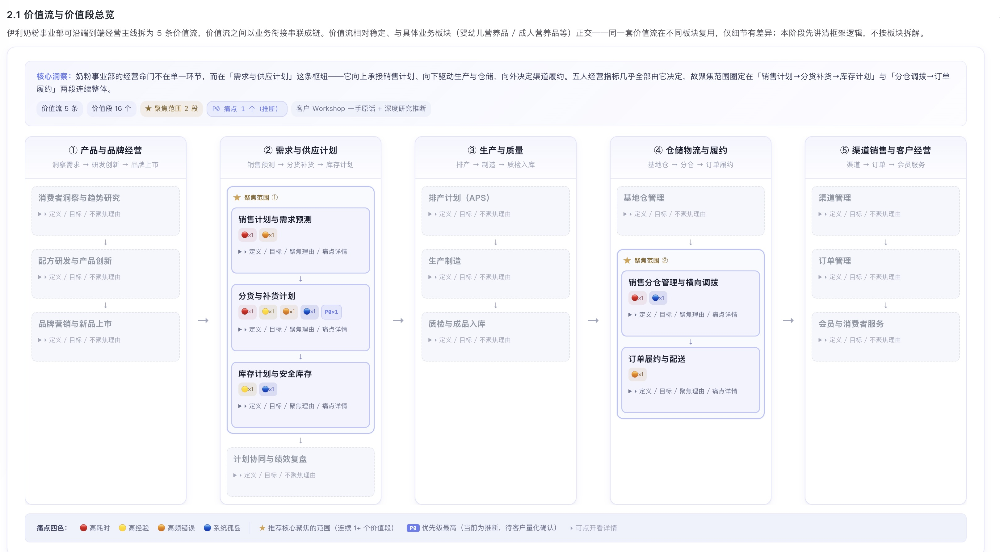

# 伊利奶粉事业部 · 业务现状全景图

> **版本：** v1.0 | **更新日期：** 2026-06-28
>
> **对应业务阶段：** 理需求（SLP）· 阶段1 企业商业模式认知 · 步骤1.2 高阶价值框架梳理（起稿）
>
> **方法论依据：** SLP 阶段1方法（高阶价值框架：价值流 → 价值段，圈定聚焦范围）
>
> **输入依据：** FDE 商机描述与分仓补货业务全貌口述（客户内部信息）；伊利股份 2024 年年度报告；伊利官网及公开报道

## 1 总览

**这份全景图做了什么：** 把伊利奶粉事业部的端到端经营拆成 5 条价值流、每条价值流内拆出价值段，并按"圈范围"逻辑圈出接下来阶段2要深挖的聚焦范围。

**重点看什么：** 聚焦范围落在两个连续段——**价值流②「需求与供应计划」的「销售计划与需求预测 → 分货与补货计划 → 库存计划」**，以及**价值流④「仓储物流与履约」的「销售分仓管理与横向调拨 → 订单履约与配送」**。这两段合起来，正是商机要打造的"推拉结合智能分仓补货计划体系"的完整落点。

**为什么这样圈：** 分货补货计划是整条供应链的枢纽——它向上承接销售计划、向下驱动生产与仓储、向外决定渠道履约。五大经营指标（分货效率、有货率、周转、新鲜度、跨仓履约）几乎全部由这个枢纽决定，是典型的"牵一发动全身"的杠杆点。

**当前洞察：** 价值流②内部呈现一条清晰因果链——**"人工 Excel 推式分货"是上游根因，"有货率不足 / 周转慢 / 新鲜度差 / 跨仓履约高"是下游结果**。因此聚焦不是散点选优，而是围绕这一条因果链做"计划体系级"的升级。

**需要 FDE 做什么：** ① 核准 5 条价值流与价值段划分是否符合客户现状；② 确认聚焦范围是否准确圈在"需求与供应计划 + 仓储物流与履约"；③ 提供价值段级量化数据，用于把 P0 痛点从"推断"升级为"客户内部数据实证"。

## 2 高阶价值框架

### 2.1 价值流与价值段总览

伊利奶粉事业部可沿端到端经营主线拆为 5 条价值流，价值流之间以业务衔接串联成链。价值流相对稳定、与具体业务板块（婴幼儿营养品 / 成人营养品等）正交——同一套价值流在不同板块复用，仅细节有差异；本阶段先讲清框架逻辑，不按板块拆解。

### 2.2 聚焦范围说明

| 聚焦范围 | 圈定价值段（连续） | 对应商机目标 | 覆盖的经营指标 |
|---|---|---|---|
| 聚焦范围 ①（价值流② 需求与供应计划） | 销售计划与需求预测 → 分货与补货计划 → 库存计划 | 销售计划精细化 + 分仓智能补货优化 | 分货效率、有货率、周转率、新鲜度 |
| 聚焦范围 ②（价值流④ 仓储物流与履约） | 销售分仓管理与横向调拨 → 订单履约与配送 | 销售仓横向调拨 | 有货率、新鲜度、跨仓履约率 |

**聚焦逻辑（为什么不是散点选优）：** 两个聚焦范围构成一条完整的因果链——聚焦范围①是"计划源头"，聚焦范围②是"执行落点"。商机的三个动作（销售计划精细化、分仓智能补货、横向调拨）恰好对应这条链上的三个关键节点，因此聚焦是"体系级"的，而非三个孤立场景。

> ⚠️ P0 痛点当前为**推断**（客户内部量化数据尚未提供），待 FDE 补充分货耗时/人力、分仓现货率、周转天数、新鲜度、跨仓履约率等数据后，再据实升级为 P0 判定。

## 3 待确认问题清单

| # | 待确认问题 | 用途与影响 |
|---|---|---|
| 1 | 5 条价值流的覆盖性与边界是否准确（尤其"需求与供应计划"是否含基地仓补货发放） | 影响价值流框架是否符合客户现状；不确认会导致阶段2拆解跑偏 |
| 2 | 聚焦范围是否准确圈在「需求与供应计划 + 仓储物流与履约」两段 | 影响阶段2聚焦拆解对象；不确认会导致拆解范围与客户优先级错位 |
| 3 | 价值段级量化数据（预测准确率、分货耗时、现货率、周转天数、新鲜度、跨仓履约率） | 影响 P0 判定与痛点热力分布；不确认会导致痛点排序缺乏实证 |
